# Documento Funcional SyncLife

**Versão:** 1.1
**Data:** Março 2026
**Objetivo:** Detalhamento passo a passo de todas as funcionalidades, requisitos de dados dos gráficos, processos E2E e diferenças entre desktop e mobile.
**Atualização 1.1:** Adicionada seção 18 com 12 features avançadas (SW Update Toast, Import Extrato Nav, Share Conquistas, AI Insights, PDF Cross-Module, Push Notifications, Weekly Digest, CI/CD, Coach IA, Cardápio Wizard, Google Calendar Sync, PRO Gate Audit).

---

## 1. Introdução e Pré-requisitos

### 1.1 Pré-requisitos para uso

- Conta criada no SyncLife (cadastro em `/cadastro`)
- Login realizado com e-mail e senha válidos
- Onboarding opcional (momento de vida e áreas de interesse) — redireciona para dashboard ao concluir

### 1.2 Breakpoints de tela

Conforme `web/src/hooks/use-breakpoint.ts`:

| Breakpoint | Largura | Uso |
|------------|---------|-----|
| Mobile | < 640px | Layout mobile, bottom bar, fontes DM Sans |
| Tablet | 640px – 1023px | Layout intermediário |
| Desktop | ≥ 1024px | Layout completo, sidebar, ModuleBar |
| Wide | ≥ 1440px | Layout expandido |

### 1.3 Navegação geral

- **ModuleBar:** barra lateral com ícones dos 11 módulos (Panorama, Finanças, Futuro, Tempo, Corpo, Mente, Patrimônio, Carreira, Experiências, Conquistas, Configurações)
- **Sidebar:** itens de navegação do módulo ativo (ex: Transações, Orçamentos, Recorrentes no módulo Finanças)
- **MobileBottomBar:** barra inferior com ícones dos módulos (mobile)
- **MobileSubNav:** abas do módulo ativo (mobile)

---

## 2. Autenticação e Onboarding

### 2.1 Login

**Passo a passo:**
1. Acessar `/` (landing) ou `/login`
2. Clicar em "Entrar"
3. Preencher e-mail e senha
4. Clicar em "Entrar"
5. Sistema redireciona para `/dashboard` ou `/financas`

**Validações:**
- Credenciais inválidas → toast "Credenciais incorretas"
- Campos vazios → permanece em `/login`

### 2.2 Cadastro

**Passo a passo:**
1. Acessar `/cadastro` (via link "Criar conta grátis")
2. Preencher: Nome completo, E-mail, Senha, Confirmar senha
3. Aceitar Termos de Uso (obrigatório para habilitar botão)
4. Clicar em "Criar minha conta"

**Validações:**
- Senha < 8 caracteres → toast de erro
- Senhas não coincidem → mensagem inline
- Botão desabilitado sem aceitar termos

### 2.3 Esqueci senha

**Passo a passo:**
1. Em `/login`, clicar em "Esqueci minha senha"
2. Acessar `/esqueceu-senha`
3. Informar e-mail
4. Clicar em "Enviar link de recuperação"
5. Mensagem "E-mail enviado!" exibida

### 2.4 Rotas protegidas

- Acesso a `/dashboard`, `/transacoes`, `/configuracoes` (e demais rotas autenticadas) sem login → redireciona para `/login`

### 2.5 Onboarding

**Passo a passo:**
1. **Olá!** — tela de boas-vindas
2. **Momento** — escolher 1 de 6 opções: Equilíbrio, Crescimento, Virada, Finanças, Metas, Hábitos
3. **Áreas** — escolher 1 ou mais de 6: Finanças, Metas, Agenda, Saúde, Carreira, Estudos
4. **Pronto** — animação de confetti, redireciona para dashboard

### 2.6 E2E — Autenticação

**Arquivo:** `web/e2e/auth.spec.ts`

| Cenário | Descrição |
|---------|-----------|
| Landing | Logo e links Entrar / Começar grátis visíveis |
| Login | Redireciona para /login ao clicar Entrar |
| Login | Erro com credenciais inválidas |
| Login | Link Esqueci senha e Criar conta visíveis |
| Login | Permanece em /login com campos vazios |
| Cadastro | Formulário carrega, botão habilita após termos |
| Cadastro | Erro senha < 8 caracteres |
| Cadastro | Erro senhas não coincidem |
| Esqueceu senha | Formulário e envio exibem sucesso |
| Rotas protegidas | /dashboard, /transacoes, /configuracoes redirecionam sem login |

---

## 3. Shell e Navegação

### 3.1 Desktop

- **ModuleBar:** ícones dos 11 módulos sempre visíveis
- **Sidebar:** itens do módulo ativo (ex: Dashboard, Transações, Orçamentos)
- **TopHeader:** saudação (Bom dia/Boa tarde/Boa noite), breadcrumb, seletor de tema (Dark/Light)
- **Life Sync Score:** sempre visível no contexto unificado

### 3.2 Mobile

- **MobileBottomBar:** ícones dos módulos na parte inferior
- **MobileSubNav:** abas do módulo (ex: Transações | Orçamentos | Recorrentes)
- **Sidebar:** fecha/colapsa automaticamente
- **Conteúdo:** layout em coluna única

### 3.3 E2E — Shell e Navegação

**Arquivo:** `web/e2e/shell-navigation.spec.ts`

| Cenário | Descrição |
|---------|-----------|
| 0.1 | ModuleBar exibe ícones de módulos |
| 0.2 | Sidebar aparece ao navegar para módulo |
| 0.4 | Trocar tema Dark ↔ Light via pill |
| 0.7 | Sidebar fecha em mobile (375px) |
| 0.8 | TopHeader mostra breadcrumb |
| 0.9 | TopHeader mostra saudação |
| 0.10 | Life Sync Score sempre visível |
| 0.11 | Navegar pelos 11 módulos sem erro |
| 0.17 | Mobile bottom bar visível em 375px |
| SHL-UNI-01 a 06 | Experiência unificada (sem data-mode, sem ModePill) |

---

## 4. Módulo Panorama (Dashboard)

**Rotas:** `/dashboard`, `/dashboard/review`, `/dashboard/score`

### 4.1 Funcionalidades principais

- Saudação personalizada + Life Sync Score (anel SVG)
- 4 KPIs: Receitas, Despesas, Saldo do Mês, Metas Ativas
- InsightCard (IA com recomendações)
- BudgetsWidget, CategorySpendWidget, GoalsWidget, WeekAgendaWidget
- RecurrencesWidget, ProjectionWidget, AchievementsWidget
- V3ModulesRow (atividades, patrimônio, viagens)
- LifeMapWidget (Mapa da Vida)

### 4.2 Gráficos e requisitos de dados

| Componente | Dados necessários | Fonte |
|-------------|-------------------|-------|
| Life Sync Score (RingProgress) | `scoreResult.total` ou `lifeScore` | useScoreEngine, useLifeMap |
| KPI Receitas/Despesas/Saldo | `transactions` (type, amount) do mês atual | useTransactions |
| KPI Metas Ativas | `goals` (status=active), `calcProgress` | useMetas |
| BudgetsWidget | `budgets` (category, amount, gasto, pct) | useBudgets |
| CategorySpendWidget | `transactions` expense agrupadas por category | useTransactions |
| GoalsWidget | `goals` ativas ordenadas por target_date | useMetas |
| WeekAgendaWidget | `events` da semana atual | useAgenda |
| RecurrencesWidget | `upcomingOccurrences` | useRecorrentes |
| ProjectionWidget (sparkline) | `balance`, `nextRecurrences`, `totalIncome` | derivado |
| LifeMapWidget | `lifeDimensions` (8 dimensões) | useLifeMap |
| V3ModulesRow | atividades da semana, patrimônio, viagens | useCorpoDashboard, usePatrimonioDashboard, useExperienciasDashboard |

### 4.3 Review semanal

**Rota:** `/dashboard/review`  
**Disponibilidade:** Domingo 20h até Quarta 23h59

**Passo a passo:**
1. Slides: capa, finanças, metas, corpo, score, badges, CTA
2. Dados persistem em `weekly_reviews`
3. Atualiza streak de reviews

### 4.4 Mobile vs Desktop — Dashboard

| Aspecto | Desktop | Mobile |
|---------|---------|--------|
| Layout | Grid completo com todos os widgets | DashboardMobile compacto |
| KPIs | 4 cards em linha | KPIs resumidos |
| Scores | Life Sync Score + LifeMap | Scores por módulo (finanças, tempo, futuro) |
| Alertas | Integrados nos widgets | mobileAlerts (orçamentos, recorrentes) |
| Navegação | Sidebar + ModuleBar | MobileBottomBar |

---

## 5. Módulo Finanças

**Rotas:** `/financas`, `/financas/transacoes`, `/financas/orcamentos`, `/financas/recorrentes`, `/financas/calendario`, `/financas/planejamento`, `/financas/relatorios`, `/financas/importar`

### 5.1 Gráficos e requisitos de dados

| Gráfico | Dados | Campos obrigatórios |
|---------|-------|---------------------|
| HistoricoChart (BarChart) | histData | `mes`, `rec`, `des` — últimos 6 meses |
| DonutChart (categorias) | catData | `nome`, `pct`, `val`, `cor` — de activeBudgets |
| FluxoCaixaChart | cfDays | `d`, `inc`, `exp`, `isToday`, `isFuture` — transações por dia do mês |
| RelatoriosTrendChart | lineChartData | `month` + colunas dinâmicas (top 5 categorias de despesa) |
| RelatoriosBarChart | barChartData | `month`, `receitas`, `despesas` |
| Planejamento Sparkline | balanceData | `balance` por mês (cenário otimista/base/pessimista) |

### 5.2 Transações

**Passo a passo — Nova transação:**
1. Acessar `/financas/transacoes`
2. Clicar em "Nova Transação"
3. Selecionar tipo: Receita ou Despesa
4. Preencher: descrição, valor, categoria, data
5. Clicar em "Adicionar"

**Filtros:** tipo (Receitas/Despesas/Todos), categoria, busca por descrição  
**Ordenação:** por data, valor, etc.  
**Validação:** submit sem preencher mantém modal aberto

### 5.3 Orçamentos

**Passo a passo:**
1. Acessar `/financas/orcamentos`
2. Copiar mês anterior ou criar novo envelope
3. Para cada envelope: categoria, valor limite
4. Barras de progresso: verde ≤70%, amarelo 70–85%, vermelho >85%

### 5.4 Recorrentes

**Passo a passo — Nova recorrente:**
1. Acessar `/financas/recorrentes`
2. Clicar em "Nova Recorrente"
3. Tipo (Receita/Despesa), descrição, valor
4. Frequência: semanal, quinzenal, mensal, etc.
5. Dia do mês
6. Toggle pausar/retomar em recorrentes existentes

### 5.5 Calendário

**Passo a passo:**
1. Acessar `/financas/calendario`
2. Grid mensal com dias
3. Clique em dia → drawer com transações do dia
4. Nova transação ou evento de planejamento
5. Navegação entre meses (setas)

### 5.6 Planejamento

**Passo a passo:**
1. Acessar `/financas/planejamento`
2. Selecionar cenário: Otimista, Realista, Pessimista
3. Timeline com meses futuros
4. Novo evento de planejamento
5. Sparkline de saldo projetado

### 5.7 Relatórios

**Passo a passo:**
1. Acessar `/financas/relatorios`
2. Selecionar período: Mês, Trimestre, Semestre, 12m, Ano, Custom
3. KPIs, gráficos de tendência, barras, categorias, taxa de poupança
4. Exportar PDF ou CSV

### 5.8 Importar extrato

**Passo a passo:**
1. Acessar `/financas/importar`
2. **Upload:** arrastar ou selecionar arquivo CSV ou OFX/QFX (Nubank, Inter, Itaú, Bradesco)
3. **Mapeamento:** associar colunas do arquivo (data, descrição, valor, tipo)
4. **Revisão:** visualizar preview, marcar linhas para skip (duplicatas)
5. **Importar:** executar importação

### 5.9 E2E — Finanças

**Arquivo:** `web/e2e/financas.spec.ts`

| Bloco | Cenários |
|-------|----------|
| 3 — Dashboard | KPIs, Fluxo de Caixa, categorias, transações recentes, navegação meses, tema |
| 4 — Transações | Listar, criar receita/despesa, filtros, busca, validação |
| 5 — Orçamentos | Listar, barras de progresso, copiar mês anterior |
| 6 — Recorrentes | Listar, nova recorrente, toggle pausar |
| 7 — Planejamento | Timeline, cenários, novo evento |
| 8 — Calendário | Grid, navegação, hoje destacado, click em dia |
| 9 — Relatórios | Comparativo, gráficos, export CSV, filtro período |

---

## 6. Módulo Futuro

**Rotas:** `/futuro`, `/futuro/novo`, `/futuro/[id]`, `/futuro/checkin`

### 6.1 Gráficos

- **LifeMapRadar:** `dimensions` (label, value, fullLabel, icon, color) — useLifeMap — radar de equilíbrio entre dimensões da vida

### 6.2 Lista de objetivos

**Passo a passo:**
1. Acessar `/futuro`
2. Filtros: Todos, Ativos, Concluídos
3. Busca por nome
4. Ordenação: prioridade, progresso, prazo

### 6.3 Novo objetivo (Wizard)

**Passo a passo:**
1. Acessar `/futuro/novo` ou clicar em "Novo Objetivo"
2. **Passo 1:** nome, tipo (monetária, peso, task, frequência, quantidade)
3. **Passo 2:** target (valor, peso, quantidade conforme tipo)
4. **Passo 3:** prazo (opcional)
5. Concluir

**Validação:** nome obrigatório, target positivo

### 6.4 Detalhe do objetivo

**Passo a passo:**
1. Clicar em card de objetivo
2. Hero com nome e progresso (RingProgress)
3. Metas, milestones, aportes
4. Botão "Aporte" ou "Contribuir" → modal
5. Editar objetivo
6. Integração com Agenda e Finanças

### 6.5 Check-in (mobile)

**Passo a passo:**
1. Acessar `/futuro/checkin`
2. Slider de humor (mood)
3. Notas
4. Progresso por objetivo
5. Dados persistem em localStorage

### 6.6 E2E — Futuro

**Arquivo:** `web/e2e/futuro.spec.ts`

| Bloco | Cenários |
|-------|----------|
| 10 — Lista | KPIs, grid de cards, filtros (Todos/Ativos/Concluídos) |
| 11 — Wizard | Abre em /futuro/nova, campos, validação, criar meta monetária/peso/task |
| 12 — Detalhe | Página carrega, hero, modal aporte, timeline milestones, badge status, editar |

---

## 7. Módulo Tempo

**Rotas:** `/tempo`, `/tempo/agenda`, `/tempo/semanal`, `/tempo/mensal`, `/tempo/novo`, `/tempo/foco`, `/tempo/review`

### 7.1 Gráficos

- **Distribuição por módulo (BarChart):** `moduleDistribution` (type → count) de `useAgenda` — eventos agrupados por tipo (trabalho, meta, saúde, etc.)

### 7.2 Dashboard Tempo

**Passo a passo:**
1. Acessar `/tempo`
2. KPIs: eventos da semana, metas, próximo evento
3. Timeline da semana
4. Próximos eventos

### 7.3 Agenda

**Passo a passo:**
1. Acessar `/tempo/agenda`
2. Lista de eventos por dia
3. Navegação mensal
4. EventModal para criar/editar
5. DeleteEventModal para excluir

### 7.4 Vista semanal

**Passo a passo:**
1. Acessar `/tempo/semanal`
2. Grade horas × dias (7 colunas)
3. Eventos posicionados por horário
4. Navegação entre semanas

### 7.5 Vista mensal

**Passo a passo:**
1. Acessar `/tempo/mensal`
2. Grid mensal com dias
3. Indicadores em dias com eventos
4. Clique em dia → detalhe

### 7.6 Novo evento

**Passo a passo:**
1. Acessar `/tempo/novo`
2. Título (obrigatório)
3. Data e hora (início, fim)
4. Tipo: Pessoal, Trabalho, Saúde, Lazer, etc.
5. Prioridade: Normal, Alta, Baixa, Urgente

### 7.7 Blocos de foco

**Passo a passo:**
1. Acessar `/tempo/foco`
2. Nova sessão de foco
3. Lista de sessões ou estado vazio
4. Filtro de período (Semana, Mês, Todos)

### 7.8 Review semanal (PRO)

**Passo a passo:**
1. Acessar `/tempo/review`
2. BarChart de distribuição de eventos por módulo

### 7.9 E2E — Tempo

**Arquivo:** `web/e2e/tempo.spec.ts`

| Bloco | Cenários |
|-------|----------|
| Vista Semanal | Heading, 7 colunas, navegação, hoje destacado, novo evento |
| Vista Mensal | Grid, indicadores, click em dia, navegação |
| Novo Evento | Formulário, título obrigatório, data/hora, validação, tipo, prioridade |
| Foco | Página carrega, nova sessão, lista, filtro período |

---

## 8. Módulo Corpo

**Rotas:** `/corpo`, `/corpo/atividades`, `/corpo/peso`, `/corpo/cardapio`, `/corpo/saude`, `/corpo/coach`

### 8.1 Gráficos

| Gráfico | Dados | Campos obrigatórios |
|---------|-------|---------------------|
| WeightChart | entries, goalWeight, months | `recorded_at`, `weight` |
| Medidas corporais | entries com waist/hip | `date`, `cintura`, `quadril` |
| Hidratação | water intake | barras por dia |

### 8.2 Dashboard Corpo

**Passo a passo:**
1. Acessar `/corpo`
2. KPIs: peso atual, TMB, atividades da semana, próxima consulta
3. Hidratação: botões para registrar copos de água
4. ActivityCard, AppointmentCard

### 8.3 Atividades

**Passo a passo:**
1. Acessar `/corpo/atividades`
2. Clicar em "Nova Atividade"
3. Tipo (corrida, caminhada, musculação, etc.), duração, intensidade
4. Integração com Agenda

### 8.4 Peso e medidas

**Passo a passo:**
1. Acessar `/corpo/peso`
2. Perfil: altura, sexo, nível de atividade, meta de peso
3. WeightChart: evolução (3/6/12 meses)
4. Registrar peso: valor, data
5. Medidas: cintura, quadril (últimos 30 registros)

**Validação:** peso deve ser positivo

### 8.5 Cardápio (IA)

**Passo a passo:**
1. Acessar `/corpo/cardapio`
2. Preferências: calorias, restrições alimentares
3. Clicar em "Gerar cardápio"
4. IA retorna cardápio semanal (API Gemini)

### 8.6 Saúde preventiva

**Passo a passo:**
1. Acessar `/corpo/saude`
2. Lista de consultas médicas
3. Nova consulta: tipo, data, médico

### 8.7 Coach IA

**Passo a passo:**
1. Acessar `/corpo/coach`
2. Chat com IA (Groq Llama)
3. Perguntas sobre saúde, hábitos, etc.

### 8.8 E2E — Corpo

**Arquivo:** `web/e2e/corpo.spec.ts`

| Bloco | Cenários |
|-------|----------|
| Dashboard | KPIs, valores formatados, links |
| Peso | Página carrega, gráfico, formulário, validação peso positivo, medidas |
| Atividades | Heading, nova atividade, lista, registro com duração e tipo |
| Saúde | Heading, consultas, nova consulta |
| Cardápio | Heading, botão gerar, campos preferências |
| Coach | Heading, chat input |

---

## 9. Módulo Mente

**Rotas:** `/mente`, `/mente/trilhas`, `/mente/trilhas/[id]`, `/mente/timer`, `/mente/sessoes`, `/mente/biblioteca`

### 9.1 Dashboard Mente

**Passo a passo:**
1. Acessar `/mente`
2. KPIs: horas da semana, streak, trilhas ativas, sessões hoje
3. TrackCard, StudySessionCard
4. TrackWizard para nova trilha

### 9.2 Timer (Pomodoro)

**Passo a passo:**
1. Acessar `/mente/timer`
2. PomodoroTimer: configuração de minutos
3. Iniciar sessão
4. Integração com Agenda (registra sessão)

### 9.3 Trilhas

**Passo a passo:**
1. Acessar `/mente/trilhas`
2. Clicar em "Nova Trilha"
3. TrackWizard: nome, categoria
4. Lista de trilhas com progresso

### 9.4 Sessões

**Passo a passo:**
1. Acessar `/mente/sessoes`
2. Histórico de sessões de estudo

### 9.5 E2E — Mente

**Arquivo:** `web/e2e/mente.spec.ts`

| Bloco | Cenários |
|-------|----------|
| Dashboard | Heading, KPIs, botão nova trilha, cards |
| Trilhas | Heading, lista com progresso, TrackWizard abre |
| Timer | Pomodoro, controles |
| Biblioteca | Página carrega |

---

## 10. Módulo Patrimônio

**Rotas:** `/patrimonio`, `/patrimonio/carteira`, `/patrimonio/carteira/[ticker]`, `/patrimonio/proventos`, `/patrimonio/evolucao`, `/patrimonio/simulador`

### 10.1 Gráficos

| Gráfico | Dados | Campos obrigatórios |
|---------|-------|---------------------|
| PieChart (carteira) | sectorData | `name`, `value`, `color` — distribuição por setor |
| Evolução (AreaChart) | dataPoints | `date`, `invested`, `current`, `withDividends` — período 3m/6m/1a/all |
| Simulador (LineChart) | buildIFProjection | `month`, `pessimistic`, `base`, `optimistic` |

### 10.2 Dashboard Patrimônio

**Passo a passo:**
1. Acessar `/patrimonio`
2. KPIs: patrimônio total, resultado, proventos 12m, renda passiva/mês
3. AssetCard, distribuição por classe

### 10.3 Carteira

**Passo a passo:**
1. Acessar `/patrimonio/carteira`
2. Lista de ativos
3. Novo ativo: ticker, quantidade, preço médio
4. Aporte/venda: modal
5. Atualizar preço: bulk ou individual
6. Integração com Finanças

### 10.4 Proventos

**Passo a passo:**
1. Acessar `/patrimonio/proventos`
2. Lista de proventos (dividendos)

### 10.5 Evolução

**Passo a passo:**
1. Acessar `/patrimonio/evolucao`
2. Seletor de período: 3m, 6m, 1a, all
3. AreaChart: investido vs valor atual (com dividendos)

### 10.6 Simulador IF

**Passo a passo:**
1. Acessar `/patrimonio/simulador`
2. Parâmetros: valor inicial, aporte mensal, taxa, renda desejada
3. LineChart com 3 cenários (pessimista, base, otimista)
4. ReferenceLine para meta de independência financeira

### 10.7 E2E — Patrimônio

**Arquivo:** `web/e2e/patrimonio.spec.ts`

| Bloco | Cenários |
|-------|----------|
| Dashboard | KPIs, links |
| Carteira | Heading, PieChart, adicionar ativo, modal, lista, atualizar preço |
| Evolução | Gráfico, período |
| Simulador | Parâmetros, projeção |

---

## 11. Módulo Carreira

**Rotas:** `/carreira`, `/carreira/perfil`, `/carreira/roadmap`, `/carreira/habilidades`, `/carreira/historico`

### 11.1 Gráficos

| Gráfico | Dados | Campos obrigatórios |
|---------|-------|---------------------|
| Salary AreaChart | history | `label`, `salary` — evolução salarial |
| Skills RadarChart | skills por categoria | `axis`, `value` — Hard Skills, Soft Skills, Idiomas, Certificações, Liderança |

### 11.2 Dashboard Carreira

**Passo a passo:**
1. Acessar `/carreira`
2. Perfil, roadmap, habilidades
3. Empty state com wizard de 3 passos (se vazio)
4. CarreiraSimuladorModal

### 11.3 Perfil profissional

**Passo a passo:**
1. Acessar `/carreira/perfil`
2. Cargo, empresa, salário, data de início
3. Salvar

### 11.4 Roadmap

**Passo a passo:**
1. Acessar `/carreira/roadmap`
2. RoadmapTimeline com marcos

### 11.5 Habilidades

**Passo a passo:**
1. Acessar `/carreira/habilidades`
2. Nova habilidade: nome, categoria, nível (Iniciante a Expert)
3. Lista com SkillCard
4. RadarChart "Arsenal do Herói"

### 11.6 Histórico

**Passo a passo:**
1. Acessar `/carreira/historico`
2. Entradas com salário, start_date
3. AreaChart de evolução salarial

### 11.7 E2E — Carreira

**Arquivo:** `web/e2e/carreira.spec.ts`

| Bloco | Cenários |
|-------|----------|
| Dashboard | KPIs, links |
| Habilidades | Heading, adicionar, lista com níveis, level selector |
| Histórico | Entradas, gráfico |
| Perfil | Campos |
| Roadmap | Timeline |

---

## 12. Módulo Experiências

**Rotas:** `/experiencias`, `/experiencias/viagens`, `/experiencias/viagens/[id]`, `/experiencias/nova`, `/experiencias/passaporte`, `/experiencias/memorias`, `/experiencias/bucket-list`

### 12.1 Dashboard Experiências

**Passo a passo:**
1. Acessar `/experiencias`
2. KPIs: próxima viagem, viagens ativas, concluídas, checklist
3. TripCard
4. Link para nova viagem

### 12.2 Nova viagem (Wizard)

**Passo a passo:**
1. Acessar `/experiencias/nova`
2. Destino (obrigatório)
3. Datas: ida, volta
4. Demais campos
5. Criar

### 12.3 Lista de viagens

**Passo a passo:**
1. Acessar `/experiencias/viagens`
2. Filtro por status
3. Cards de viagem

### 12.4 Detalhe da viagem

**Passo a passo:**
1. Clicar em viagem
2. Abas: Itinerário (TripItineraryTab), etc.
3. Editar, excluir

### 12.5 Passaporte

**Passo a passo:**
1. Acessar `/experiencias/passaporte`
2. Destinos visitados

### 12.6 Memórias

**Passo a passo:**
1. Acessar `/experiencias/memorias`
2. Lista de memórias
3. Nova memória

### 12.7 Bucket list

**Passo a passo:**
1. Acessar `/experiencias/bucket-list`
2. Itens da bucket list
3. Adicionar, marcar como realizado

### 12.8 E2E — Experiências

**Arquivo:** `web/e2e/experiencias.spec.ts`

| Bloco | Cenários |
|-------|----------|
| Dashboard | Heading, botão nova viagem, KPIs |
| Wizard | Heading, destino, datas, validação |
| Lista | Filtros, cards |
| Detalhe | Abas, editar |
| Passaporte | Destinos |
| Memórias | Lista |
| Bucket list | Itens |

---

## 13. Módulo Conquistas

**Rotas:** `/conquistas`, `/conquistas/ranking`

### 13.1 Conquistas

**Passo a passo:**
1. Acessar `/conquistas`
2. Badges por categoria (fin, meta, cons, agenda, corpo, patrimonio, experiencias)
3. Filtros, busca
4. Progress bars por badge
5. AIInsightCard
6. Compartilhamento (download de card)

### 13.2 Ranking

**Passo a passo:**
1. Acessar `/conquistas/ranking`
2. Abas: Global, Mensal, Semanal
3. AreaChart de evolução de score (dados mock)

### 13.3 E2E — Conquistas

**Arquivo:** `web/e2e/conquistas.spec.ts`

| Cenário | Descrição |
|---------|-----------|
| Página carrega | Badges, filtros |
| Filtros | Categoria funciona |
| Ranking | Acessível |
| Badge modal | Abre ao clicar badge |
| Z-index | Modal correto |

---

## 14. Configurações

**Rotas:** `/configuracoes`, `/configuracoes/aparencia`, `/configuracoes/notificacoes`, `/configuracoes/categorias`, `/configuracoes/integracoes`, `/configuracoes/plano`

### 14.1 Perfil

**Passo a passo:**
1. Acessar `/configuracoes`
2. Nome, moeda, timezone, avatar
3. Alterar senha (AlterarSenhaModal)
4. Excluir conta

### 14.2 Aparência

**Passo a passo:**
1. Acessar `/configuracoes/aparencia`
2. 12 temas: Navy Dark, Obsidian, Rosewood, Graphite, Twilight, Carbon, Clean Light, Mint Garden, Arctic, Sahara, Blossom, Serenity
3. Modo automático (sistema)
4. Tema persiste no profile do usuário

### 14.3 Notificações

**Passo a passo:**
1. Acessar `/configuracoes/notificacoes`
2. Push, email
3. Orçamento, metas, lembretes
4. Toggles por tipo

### 14.4 Categorias

**Passo a passo:**
1. Acessar `/configuracoes/categorias`
2. CRUD de categorias de transações
3. Nome, ícone, cor

### 14.5 Integrações

**Passo a passo:**
1. Acessar `/configuracoes/integracoes`
2. Configuração de integrações externas

### 14.6 Plano

**Passo a passo:**
1. Acessar `/configuracoes/plano`
2. Plano atual: FREE ou PRO
3. Upgrade via Stripe

### 14.7 E2E — Configurações

**Arquivo:** `web/e2e/configuracoes.spec.ts`

| Cenário | Descrição |
|---------|-----------|
| 2.1 | Perfil: campos nome visíveis |
| 2.1b | Perfil: botão salvar ao editar |
| 2.4 | Notificações: toggles visíveis |
| 2.5 | Categorias: página carrega |
| 2.6 | Integrações: página carrega |
| 2.7 | Plano: exibe plano atual |
| 2.9 | Theme toggle persiste após reload |

---

## 15. Execução dos Testes E2E

### 15.1 Pré-requisitos

```bash
# Variáveis de ambiente (obrigatórias para testes autenticados)
PLAYWRIGHT_TEST_EMAIL=seu@email.com
PLAYWRIGHT_TEST_PASSWORD=suasenha
```

Sem essas variáveis, os testes que usam `authenticatedPage` são ignorados.

### 15.2 Comandos

```bash
cd web

# Todos os testes
npx playwright test

# Por arquivo
npx playwright test auth.spec.ts
npx playwright test financas.spec.ts
npx playwright test futuro.spec.ts
npx playwright test tempo.spec.ts
npx playwright test corpo.spec.ts
npx playwright test mente.spec.ts
npx playwright test patrimonio.spec.ts
npx playwright test carreira.spec.ts
npx playwright test experiencias.spec.ts
npx playwright test conquistas.spec.ts
npx playwright test configuracoes.spec.ts
npx playwright test shell-navigation.spec.ts
npx playwright test design-system.spec.ts

# Navegador específico
npx playwright test --project=chromium

# Modo UI (debug)
npx playwright test --ui

# Modo headed (ver browser)
npx playwright test --headed
```

### 15.3 Fixture de autenticação

O arquivo `web/e2e/fixtures.ts` define `authenticatedPage`:
- Faz login uma vez
- Compartilha a sessão entre todos os testes do `describe`
- Redireciona para `/dashboard` ou `/financas` após login

### 15.4 Helpers

**Arquivo:** `web/e2e/helpers/crud.helpers.ts`

| Helper | Função |
|--------|--------|
| openCreateModal | Abre modal via botão |
| fillField | Preenche campo por placeholder/label |
| waitForToast | Aguarda toast de sucesso/erro |
| closeModal | Fecha modal (botão ou Escape) |
| goToPrevMonth / goToNextMonth | Navegação de mês |
| clickTab | Clica em tab/pill por nome |

---

## 16. Resumo Desktop vs Mobile

| Aspecto | Desktop | Mobile |
|---------|---------|--------|
| Navegação principal | ModuleBar + Sidebar | MobileBottomBar + MobileSubNav |
| Breakpoint | ≥ 1024px | < 640px (sm), 640–1023px (tablet) |
| Dashboard | Grid completo com todos os widgets | DashboardMobile compacto |
| Finanças | FAB, layout 2 colunas | FinancasMobileShell, tabs |
| Futuro | Grid de cards | FuturoMobile, wizard mobile |
| Corpo | Layout padrão | CorpoMobile, modais |
| Mente | Layout padrão | MenteMobile |
| Patrimônio | Layout padrão | PatrimonioMobile |
| Experiências | Layout padrão | ExperienciasMobile, tabs |
| Carreira | Layout padrão | CarreiraMobile |
| Tempo | Layout padrão | TempoMobileShell |
| Formulários | Modais desktop | Modais full-screen ou sheet |
| Fonte body | Outfit | DM Sans (< 1024px via media query) |
| Sidebar | Sempre acessível | Fecha/colapsa |

---

## 17. Diagrama de Dependências de Dados (Dashboard)

```mermaid
flowchart TB
    subgraph hooks [Hooks de Dados]
        useTransactions[useTransactions]
        useBudgets[useBudgets]
        useMetas[useMetas]
        useAgenda[useAgenda]
        useRecorrentes[useRecorrentes]
        useCorpoDashboard[useCorpoDashboard]
        usePatrimonioDashboard[usePatrimonioDashboard]
        useExperienciasDashboard[useExperienciasDashboard]
        useLifeMap[useLifeMap]
        useScoreEngine[useScoreEngine]
    end

    subgraph widgets [Widgets]
        KPIs[KPIs]
        BudgetsWidget[BudgetsWidget]
        CategorySpend[CategorySpendWidget]
        GoalsWidget[GoalsWidget]
        WeekAgenda[WeekAgendaWidget]
        Recurrences[RecurrencesWidget]
        Projection[ProjectionWidget]
        LifeMap[LifeMapWidget]
    end

    useTransactions --> KPIs
    useTransactions --> CategorySpend
    useBudgets --> BudgetsWidget
    useMetas --> KPIs
    useMetas --> GoalsWidget
    useAgenda --> WeekAgenda
    useRecorrentes --> Recurrences
    useRecorrentes --> Projection
    useCorpoDashboard --> V3[V3ModulesRow]
    usePatrimonioDashboard --> V3
    useExperienciasDashboard --> V3
    useLifeMap --> LifeMap
    useScoreEngine --> LifeSync[LifeSyncScore]
```



---

## 18. Features Avançadas (Sprint Mar 2026)

### 18.1 SW Update Toast

**Componente:** `web/src/components/pwa/sw-register.tsx`
**Arquivo relacionado:** `web/public/sw.js`

**Descrição:** Quando uma nova versão do Service Worker é detectada (o SW instalou mas há um controller ativo anterior), um toast persistente (sonner, `duration: Infinity`) aparece com a mensagem "Nova versão disponível!" e um botão "Atualizar agora". O usuário controla o momento da atualização.

**Passo a passo:**
1. O componente `ServiceWorkerRegistration` registra `/sw.js` no mount
2. Listener `updatefound` detecta novo SW em estado `installing`
3. Quando o novo SW muda para `installed` (e já existe um controller ativo), exibe o toast via sonner
4. Ao clicar em "Atualizar agora", envia `postMessage({ type: 'SKIP_WAITING' })` ao worker
5. O SW executa `self.skipWaiting()`, dispara o evento `controllerchange`
6. Listener de `controllerchange` recarrega a página (`window.location.reload()`)

**Notas:**
- Em ambiente de desenvolvimento (HTTP), falhas de registro do SW são silenciosas
- O toast permanece visível até o usuário agir (sem timeout)

---

### 18.2 Import Extrato — Navegação via Sidebar

**Arquivo de configuração:** `web/src/lib/modules.ts`
**Rota:** `/financas/importar`

**Descrição:** A página de importação de extratos agora é acessível diretamente pela sidebar do módulo Finanças como item de navegação. Suporta importação de arquivos CSV e OFX/QFX (Nubank, Inter, Itaú, Bradesco) com um wizard de 4 passos.

**Passo a passo:**
1. Acessar módulo Finanças via ModuleBar
2. Clicar em "Importar" na sidebar (novo item de navegação)
3. **Upload:** arrastar ou selecionar arquivo CSV ou OFX/QFX
4. **Mapeamento:** associar colunas do arquivo (data, descrição, valor, tipo)
5. **Revisão:** visualizar preview, marcar linhas para skip (duplicatas detectadas)
6. **Importar:** executar importação das transações selecionadas

---

### 18.3 Compartilhamento de Conquistas com Imagem

**Arquivos:**
- `web/src/lib/share/badge-image.ts` — geração de imagem via Canvas API
- `web/src/lib/share/share-utils.ts` — utilitários de compartilhamento
- `web/src/app/(app)/conquistas/page.tsx` — integração na página

**Descrição:** Ao visualizar uma conquista (badge), o usuário pode compartilhar uma imagem card 600x400 gerada via Canvas API. O card inclui ícone do badge, nome, descrição, pill de raridade (Comum/Incomum/Rara/Lendária) e watermark SyncLife. Suporta 4 canais de compartilhamento.

**Passo a passo:**
1. Acessar `/conquistas`
2. Clicar em um badge desbloqueado para abrir o modal
3. Clicar em "Compartilhar"
4. Opções de compartilhamento:
   - **Web Share API:** se o dispositivo suporta `navigator.canShare({ files })`, abre o share nativo com a imagem PNG
   - **WhatsApp:** abre `wa.me` com texto formatado da conquista
   - **Twitter/X:** abre `twitter.com/intent/tweet` com texto da conquista
   - **Copiar link:** copia texto descritivo para o clipboard
5. Fallback: se Web Share API não suportado, faz download da imagem PNG

**Detalhes do card gerado:**
- Dimensões: 600x400 pixels, formato PNG
- Background: gradiente escuro (#0a1628 para #0d2847)
- Barra de acento superior e inferior: gradiente Esmeralda para Azul Elétrico
- Pill de raridade com cor por nível: common (#64748b), uncommon (#10b981), rare (#8b5cf6), legendary (#f59e0b)
- Word wrap automático na descrição

---

### 18.4 AI Financial Insights (PRO)

**Arquivos:**
- `web/src/hooks/use-financial-insights.ts` — hook de dados
- `web/src/components/financas/FinancialInsightCard.tsx` — componente visual

**Descrição:** Card de insights financeiros gerados por IA (Google Gemini via `/api/ai/financas`). O hook busca transações do mês, calcula contexto financeiro (receitas, despesas, saldo, taxa de poupança, top 5 categorias) e envia para a IA, que retorna 3 insights tipados. Feature exclusiva PRO, protegida por ProGate.

**Passo a passo:**
1. Componente `FinancialInsightCard` é renderizado no dashboard de Finanças
2. ProGate verifica se o plano é PRO (feature `financas:aiInsights`)
3. Hook `useFinancialInsights({ month, year })` verifica cache no localStorage
4. Se cache válido (mesmo mês/ano): retorna insights cacheados
5. Senão: busca transações do mês via Supabase, calcula contexto, chama `/api/ai/financas`
6. A IA retorna 3 insights com prefixos `[POSITIVO]`, `[ALERTA]` ou `[DICA]`
7. Insights parseados e cacheados em localStorage (chave `sl_fin_insights_YYYY-MM`)
8. Botão "Regenerar" (RefreshCw) força nova consulta à IA (ignora cache)

**Tipos de insight:**
| Tipo | Cor | Ícone |
|------|-----|-------|
| POSITIVO (positive) | `#10b981` | TrendingUp |
| ALERTA (warning) | `#f59e0b` | AlertTriangle |
| DICA (tip) | `#0055ff` | Sparkles |

**Validação:** Se não há transações no mês, exibe dica genérica sem chamar IA.

---

### 18.5 Relatório PDF Cross-Module (PRO)

**Arquivos:**
- `web/src/lib/pdf/relatorio-completo.ts` — gerador PDF via jsPDF + jspdf-autotable
- `web/src/hooks/use-relatorio-completo.ts` — hook de orquestração

**Descrição:** Relatório completo em PDF A4 cobrindo 7 módulos: Life Sync Score, Finanças, Futuro, Corpo, Patrimônio, Tempo e Mente. Seções sem dados são automaticamente omitidas. Gerado client-side via jsPDF. Feature exclusiva PRO (feature `panorama:pdfReport`).

**Passo a passo:**
1. Acessar Dashboard ou Configurações
2. Clicar em "Relatório Completo" (botão protegido por ProGate)
3. Hook `useRelatorioCompleto()` busca dados de todos os módulos em paralelo via `Promise.all`
4. Monta objeto `ReportData` com seções condicionais
5. Chama `generateRelatorioPdfCompleto(data)` que gera o PDF
6. PDF é baixado automaticamente com nome `SyncLife_Relatorio_Completo_{periodo}.pdf`

**Seções do relatório:**
| Seção | Cor do header | Dados |
|-------|---------------|-------|
| Life Sync Score | Indigo (#6366F1) | Score total + 8 dimensões em tabela |
| Finanças | Esmeralda (#10b981) | Receitas, Despesas, Saldo, Taxa Poupança, Top 5 categorias |
| Futuro | Roxo (#8B5CF6) | Metas ativas/concluídas, progresso por meta |
| Corpo | Laranja (#F97316) | Atividades, minutos, peso atual |
| Patrimônio | Azul (#3B82F6) | Valor total, investido, rentabilidade |
| Tempo | Cyan (#06B6D4) | Total eventos, concluídos |
| Mente | Amarelo (#EAB308) | Horas de estudo, trilhas ativas |

**Notas:**
- Paginação automática: verifica espaço disponível antes de cada seção (`checkPage`)
- Footer em todas as páginas: "Gerado por SyncLife — Página X de Y"
- Dependências: `jspdf`, `jspdf-autotable` (lazy import)

---

### 18.6 Push Notifications (Web Push)

**Arquivos:**
- `web/src/hooks/use-push-notifications.ts` — hook client-side
- `web/src/app/api/push/subscribe/route.ts` — API de inscrição/remoção
- `web/src/app/api/push/send/route.ts` — API de envio

**Descrição:** Sistema de notificações push baseado em VAPID (Voluntary Application Server Identification). Suporta subscribe, unsubscribe e envio de notificações via web-push. Toggle de ativação em Configurações > Notificações.

**Pré-requisitos:**
- Variáveis de ambiente: `NEXT_PUBLIC_VAPID_PUBLIC_KEY`, `VAPID_PRIVATE_KEY`
- Service Worker registrado e ativo
- Suporte do navegador: `serviceWorker`, `PushManager`, `Notification`

**Passo a passo — Ativar push:**
1. Acessar `/configuracoes/notificacoes`
2. Toggle "Push Notifications"
3. Hook `usePushNotifications()` verifica suporte do browser
4. `subscribe()` solicita permissão via `Notification.requestPermission()`
5. Se concedida: cria subscription via `PushManager.subscribe()` com applicationServerKey (VAPID)
6. Envia subscription (endpoint, keys p256dh/auth) para `POST /api/push/subscribe`
7. API persiste em tabela `push_subscriptions` no Supabase

**Passo a passo — Desativar push:**
1. Toggle "Push Notifications" off
2. `unsubscribe()` busca subscription ativa
3. Envia `DELETE /api/push/subscribe` com endpoint
4. Remove subscription do PushManager local

**Interface do hook:**
```typescript
interface UsePushNotificationsReturn {
  isSupported: boolean
  permission: NotificationPermission | 'unsupported'
  isSubscribed: boolean
  loading: boolean
  subscribe: () => Promise<void>
  unsubscribe: () => Promise<void>
}
```

---

### 18.7 Weekly Digest (Cron)

**Arquivos:**
- `web/src/app/api/cron/weekly-digest/route.ts` — rota cron
- `web/vercel.json` — configuração de schedule

**Descrição:** Resumo semanal automático enviado via push notification e notificação in-app. Roda todo Domingo às 10h UTC. Agrega dados de finanças (saldo semanal), metas ativas e eventos concluídos.

**Schedule:** `0 10 * * 0` (Domingo 10:00 UTC)

**Autenticação:** Header `Authorization: Bearer ${CRON_SECRET}` (protegido)

**Passo a passo:**
1. Vercel Cron dispara `GET /api/cron/weekly-digest` no schedule
2. Autentica via `CRON_SECRET` no header Authorization
3. Usa Supabase service role (sem auth de usuário)
4. Busca todos os `push_subscriptions` e agrupa por `user_id`
5. Para cada usuário:
   a. Busca transações da semana (7 dias anteriores)
   b. Busca metas ativas
   c. Busca eventos da semana e conta concluídos
   d. Monta mensagem: "Saldo semanal: R$ X | Y metas ativas | Z/W eventos concluídos"
6. Cria notificação in-app em `notifications` (type: `weekly_summary`, module: `panorama`)
7. Envia push notification via web-push para cada subscription do usuário
8. Subscriptions expiradas são automaticamente removidas (cleanup)

**Resposta:**
```json
{ "message": "Digest sent", "sent": 5, "users": 3 }
```

---

### 18.8 CI/CD + Coverage

**Arquivos:**
- `web/vitest.config.mts` — configuração Vitest
- `.github/workflows/ci.yml` — workflow GitHub Actions

**Descrição:** Pipeline de integração contínua com Vitest, coverage via @vitest/coverage-v8, threshold de 80% em linhas, e upload de artefato de coverage.

**Workflow CI (GitHub Actions):**
1. Trigger: push em `main` ou `auditoria-fase0-cleanup`, ou PR para `main`
2. Runner: `ubuntu-latest`, Node 20
3. Steps:
   a. `npm ci` — instala dependências
   b. `npx tsc --noEmit` — typecheck
   c. `npm run lint` — lint
   d. `npx vitest run --coverage` — testes unitários com coverage
   e. Upload artifact `coverage-report` (retenção 7 dias)
   f. `npm run build` — build de produção (com env vars placeholder)

**Vitest config:**
- Environment: `node`
- Globals: `true`
- Include: `src/**/__tests__/**/*.test.ts`, `src/**/__tests__/**/*.test.tsx`
- Coverage provider: `v8`, reporters: `text` + `lcov`
- Coverage include: `src/lib/**/*.ts`, `src/hooks/**/*.ts`
- Coverage exclude: `src/lib/supabase/**`, `__tests__`, `.d.ts`
- Threshold: 80% linhas

---

### 18.9 Coach IA Cross-Module (PRO)

**Arquivos:**
- `web/src/app/(app)/coach/page.tsx` — página do Coach
- `web/src/components/shell/CoachFab.tsx` — FAB (Floating Action Button)
- `web/src/app/api/ai/coach/route.ts` — API route (Groq Llama 3.3)

**Descrição:** Chat com IA que analisa dados de múltiplos módulos (finanças, futuro, corpo, patrimônio) para oferecer recomendações personalizadas. Acessível via FAB flutuante no shell (visível em todas as páginas para usuários PRO) ou diretamente em `/coach`. A rota `/corpo/coach` redireciona para `/coach`.

**Feature PRO:** `coach:aiCoach` (ProGate wrapper na página)

**Dados cross-module enviados ao coach:**
| Módulo | Dados | Hook |
|--------|-------|------|
| Finanças | income, expenses, balance, savingsRate | useTransactions |
| Futuro | activeGoals, nome/progresso das metas | useMetas |
| Corpo | weight, height, weightGoal, activityLevel | useHealthProfile |
| Patrimônio | totalValue, assetCount | usePatrimonioDashboard |

**Passo a passo:**
1. Clicar no FAB (ícone Bot, gradiente Esmeralda/Azul) ou navegar para `/coach`
2. ProGate verifica plano PRO
3. Tela de boas-vindas com 6 prompts sugeridos (ex: "Como melhorar meu Life Sync Score?")
4. Digitar mensagem ou clicar em prompt sugerido
5. Hook monta `lifeContext` com dados dos 4 módulos
6. Envia para `/api/ai/coach` com `messages`, `healthProfile` e `lifeContext`
7. Resposta via streaming (ReadableStream) — mensagem aparece incrementalmente
8. Histórico de chat mantido em estado local (não persistido)

**CoachFab:**
- Posição: fixed bottom-right (bottom-5 right-5, z-50)
- Em mobile: `bottom-[72px]` (acima da MobileBottomBar)
- Oculto em: `/coach` (página do coach), `/configuracoes`, e para usuários FREE
- Visual: círculo 52px, gradiente SyncLife, sombra esmeralda

---

### 18.10 Cardápio IA Wizard (PRO)

**Arquivos:**
- `web/src/components/corpo/CardapioWizard.tsx` — wizard de 4 passos
- `web/supabase/migrations/023_dietary_preferences.sql` — migration DB

**Descrição:** Wizard de configuração obrigatória (primeira vez) antes de gerar cardápios com IA. Coleta dados físicos, calcula TMB/TDEE (Harris-Benedict), preferências alimentares e salva em `health_profiles`. Feature PRO (feature `corpo:aiCardapio`).

**Passo a passo:**
1. Acessar `/corpo/cardapio`
2. Se `cardapio_wizard_completed = false` ou primeiro acesso: wizard exibido
3. **Passo 1 — Dados Físicos + TMB:**
   - Peso (kg), Altura (cm), Idade, Sexo (Masculino/Feminino)
   - Nível de atividade: Sedentário, Leve, Moderado, Ativo, Muito Ativo
   - TMB calculado via Harris-Benedict: homem = 88.362 + (13.397 * peso) + (4.799 * altura) - (5.677 * idade)
   - TDEE = TMB * multiplicador de atividade (1.2 a 1.9)
   - Preview em tempo real: "TMB: X kcal · TDEE: Y kcal/dia"
4. **Passo 2 — Tipo de Dieta:**
   - 8 opções: Balanceada, Low Carb, Cetogênica, Vegetariana, Vegana, Carnívora, Mediterrânea, Paleo
   - Seleção única (radio-style com cards)
5. **Passo 3 — Proteínas Preferidas:**
   - 7 opções (múltipla escolha): Frango, Carne Bovina, Peixe, Ovos, Whey Protein, Tofu, Leguminosas
   - Toggle chips com ícones emoji
6. **Passo 4 — Refeições e Suplementos:**
   - Refeições por dia: 3, 4, 5 ou 6 (seleção única)
   - Toggles: Pré-treino, Pós-treino
   - Suplementos (múltipla escolha): Creatina, Whey, BCAA, Glutamina, Multivitamínico, Ômega 3
7. Clicar em "Concluir" salva via upsert em `health_profiles` (onConflict: `user_id`)
8. Campos persistidos: diet_type, preferred_proteins, meals_per_day, pre_workout_meal, post_workout_meal, supplements, cardapio_wizard_completed

**Migration 023:** Adiciona colunas à tabela `health_profiles`: `diet_type`, `preferred_proteins`, `meals_per_day`, `pre_workout_meal`, `post_workout_meal`, `supplements`, `cardapio_wizard_completed`

---

### 18.11 Google Calendar Sync

**Arquivos:**
- `web/src/app/api/integrations/google-calendar/auth/route.ts` — inicia OAuth flow
- `web/src/app/api/integrations/google-calendar/callback/route.ts` — callback OAuth
- `web/src/app/api/integrations/google-calendar/sync/route.ts` — sincronização bidirecional
- `web/supabase/migrations/024_user_integrations.sql` — tabela de integrações

**Descrição:** Integração bidirecional com Google Calendar via OAuth 2.0. Permite conectar, sincronizar e desconectar a conta Google. Gerenciado em Configurações > Integrações.

**Pré-requisitos:**
- Variáveis de ambiente: `GOOGLE_CLIENT_ID`, `GOOGLE_CLIENT_SECRET`
- `NEXT_PUBLIC_APP_URL` configurada corretamente
- Projeto Google Cloud com Calendar API habilitada

**Scopes OAuth:**
- `https://www.googleapis.com/auth/calendar.readonly`
- `https://www.googleapis.com/auth/calendar.events`

**Passo a passo — Conectar:**
1. Acessar `/configuracoes/integracoes`
2. Clicar em "Conectar" no card Google Calendar
3. `GET /api/integrations/google-calendar/auth` verifica autenticação Supabase
4. Redireciona para Google OAuth (`accounts.google.com/o/oauth2/v2/auth`)
5. Usuário autoriza acesso
6. Google redireciona para `/api/integrations/google-calendar/callback` com code
7. Callback troca code por tokens (access_token, refresh_token)
8. Tokens salvos na tabela `user_integrations` (provider: `google-calendar`)

**Passo a passo — Sincronizar:**
1. Clicar em "Sincronizar" no card Google Calendar
2. `POST /api/integrations/google-calendar/sync`
3. Busca eventos do Google Calendar
4. Sincroniza com `agenda_events` no Supabase
5. Bidirectional: eventos criados no SyncLife também são enviados ao Google Calendar

**Passo a passo — Desconectar:**
1. Clicar em "Desconectar" no card Google Calendar
2. Remove tokens da tabela `user_integrations`

**Migration 024:** Cria tabela `user_integrations` com colunas: `id`, `user_id`, `provider`, `access_token`, `refresh_token`, `token_expires_at`, `metadata`, `created_at`, `updated_at`

---

### 18.12 PRO Gate Audit

**Arquivo principal:** `web/src/hooks/use-plan-limits.ts`
**Componente:** `web/src/components/ui/pro-gate.tsx`

**Descrição:** Todas as features de IA e features avançadas são devidamente protegidas por ProGate. O hook `usePlanLimits()` verifica o plano do usuário (FREE/PRO) e o sistema de gating controla acesso a features baseado no plano.

**Features exclusivas PRO (8 total):**

| Feature Key | Módulo | Descrição |
|-------------|--------|-----------|
| `futuro:checkin` | Futuro | Check-in de humor e progresso |
| `tempo:timerFoco` | Tempo | Timer Pomodoro / Blocos de foco |
| `experiencias:aiSuggestions` | Experiências | Sugestões de viagem por IA |
| `corpo:aiCardapio` | Corpo | Geração de cardápio por IA |
| `corpo:aiCoach` | Corpo | Coach IA (redirecionado para /coach) |
| `coach:aiCoach` | Coach | Coach IA cross-module |
| `financas:aiInsights` | Finanças | Insights financeiros por IA |
| `panorama:pdfReport` | Panorama | Relatório PDF cross-module |

**Features com limites numéricos (FREE vs PRO):**

| Feature Key | FREE | PRO |
|-------------|------|-----|
| `futuro:objectives` | Limitado | Ilimitado |
| `experiencias:trips` | Limitado | Ilimitado |
| `mente:tracks` | Limitado | Ilimitado |
| `patrimonio:assets` | Limitado | Ilimitado |
| `carreira:roadmaps` | Limitado | Ilimitado |
| `corpo:consultations` | Limitado | Ilimitado |

---

## Referências

- `web/src/lib/modules.ts` — lista de módulos e rotas
- `web/src/app/(app)/dashboard/page.tsx` — estrutura de dados do dashboard
- `web/e2e/fixtures.ts` — autenticação E2E
- `web/e2e/helpers/crud.helpers.ts` — helpers de CRUD
- `docs/AUDITORIA-COMPLETA-2026-03.md` — inventário de páginas e hooks
- `CLAUDE.md` — guia de desenvolvimento do projeto
- `web/src/hooks/use-financial-insights.ts` — hook de insights financeiros IA
- `web/src/hooks/use-push-notifications.ts` — hook de push notifications
- `web/src/hooks/use-relatorio-completo.ts` — hook de relatório PDF cross-module
- `web/src/lib/share/badge-image.ts` — geração de imagem de badge via Canvas
- `web/src/lib/share/share-utils.ts` — utilitários de compartilhamento social
- `web/src/lib/pdf/relatorio-completo.ts` — gerador PDF jsPDF
- `web/src/components/shell/CoachFab.tsx` — FAB do Coach IA
- `web/src/components/corpo/CardapioWizard.tsx` — wizard de preferências alimentares
- `web/src/components/financas/FinancialInsightCard.tsx` — card de insights IA
- `.github/workflows/ci.yml` — pipeline CI com coverage
